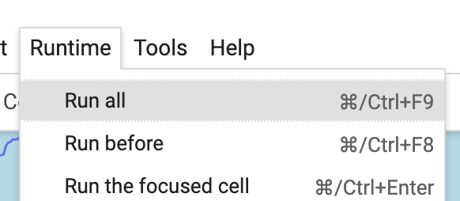
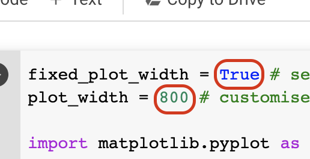
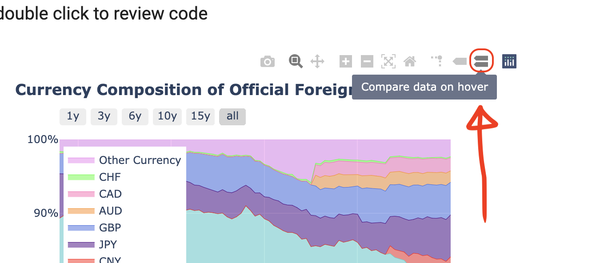
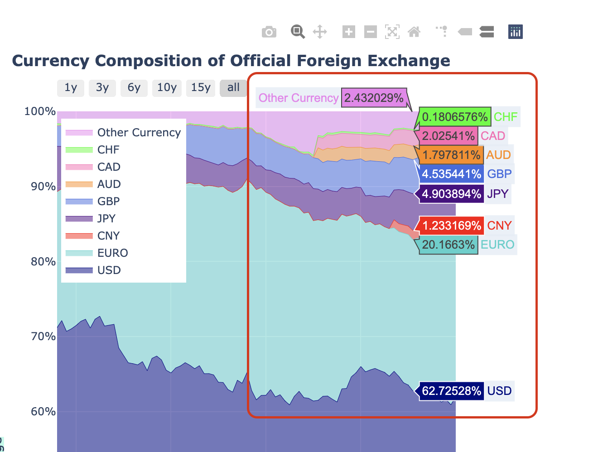

# Fintech Colab

### 1. HKMA Data
https://colab.research.google.com/github/cyywu/FintechColab/blob/master/colab/HKMA_Data.ipynb
- HK Monetary Base
- Money Multiplier 
- Total deposits & M3 (HKD) 
- Loan to Deposits
- Clearing House Turnover

### 2. Currency Composition of Official Foreign Exchange
https://colab.research.google.com/github/cyywu/FintechColab/blob/master/colab/Cofer.ipynb

### 3. Foreign Holders of US Treasure Securities
https://colab.research.google.com/github/cyywu/FintechColab/blob/master/colab/FHoTS.ipynb

### 4. BIS Data
https://colab.research.google.com/github/cyywu/FintechColab/blob/master/colab/BIS_Data.ipynb
- Trend of Over-the-Counter FX by Instrument
- Trend of Over-the-Counter FX by Currency Distribution
- Trend of Over-the-Counter FX by Currency Pair
- Trend of Over-the-Counter FX by Geographical Distribution 

---
### To re-run the program
- Runtime > Run All
- or Runtime > Restart and run all

### To customise the plot width
- set 'plot_width'
- or set 'fixed_plot_width' to False if you want the plot width to be responsive

### Make use of 'Compare data on hover'

